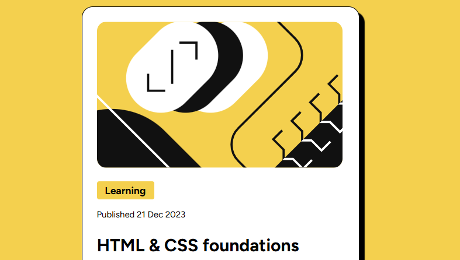

# Blog Preview Card

## Descrição
Este projeto é um cartão de visualização de blog, desenvolvido como parte do desafio do Frontend Mentor. O objetivo é criar um layout atraente e responsivo que exiba um artigo de forma clara e acessível.

## Preview 

## Estrutura do Projeto

### HTML
- **Estrutura básica**: Começa com a declaração `<!DOCTYPE html>` e inclui os elementos meta essenciais.
- **Cabeçalho**: Inclui ícone e link para o CSS.
- **Conteúdo**:
  - **Imagem e Título**: Uma imagem ilustrativa seguida pelo título do artigo.
  - **Data de Publicação**: Exibe a data em que o artigo foi publicado.
  - **Link para o Artigo**: O título do artigo é um link clicável.
  - **Descrição**: Um parágrafo que resume o conteúdo do artigo.
  - **Autor**: Uma seção com a imagem do autor e seu nome.

### CSS
- **Estilização**: Utiliza as fontes "Figtree" e "Inter" para uma aparência moderna.
- **Design Responsivo**: O layout se adapta a diferentes tamanhos de tela com um máximo de largura definido.
- **Cores e Layout**: Cores harmoniosas e um design claro com sombras e bordas arredondadas para um efeito estético agradável.
- **Classes**: Classes específicas para estilizar diferentes elementos, como `.caixa`, `.box_img1`, e `.box_img2`.

## Tecnologias Utilizadas
- **HTML5**
- **CSS3**
- **Google Fonts**: Integração de fontes personalizadas para um design mais atraente.

## Como Usar
1. Faça o download ou clone o repositório.
2. Abra o arquivo `index.html` em um navegador.
3. O cartão é totalmente responsivo e se adapta a diferentes tamanhos de tela.

## Atribuições
- Desafio por [Frontend Mentor](https://www.frontendmentor.io?ref=challenge).
- Coded by [Bruno Lima (s7tec)](https://www.frontendmentor.io/profile/s7tec).
